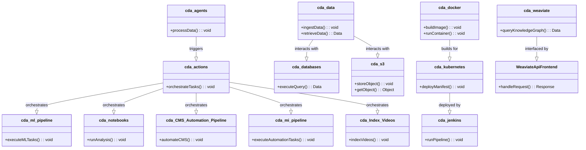

# cda.data-lake
## Public Facing Repository

Cdaprod Data Lake for cda namespace.

Creating a data lake infrastructure on a Kubernetes platform is a large-scale project that requires careful planning, robust design, and efficient execution. The `Cdaprod` GitHub organization hosts a variety of repositories, each serving a unique role in this overarching project. Let's delve into the engineering perspective of how these repositories intertwine to form a coherent and functional data lake infrastructure.




### Python Agents:
- The `cda.agents` repository hosts Python agents that are instrumental in processing and handling data within the infrastructure. These agents can be envisaged as standalone microservices or components within a larger service, each tailored to perform specific tasks such as data validation, transformation, or any other data-centric operation.

### Workflows:
- The `cda.actions` repository encapsulates the workflows within the system. These workflows orchestrate the execution of tasks, ensuring that each task is carried out in the correct order and adheres to the specified conditions. They serve as the glue that binds the various microservices and components together into a coherent process flow.

### Data Pipelines:
- The repositories `cda.ml-pipeline` and `cda.notebooks` are dedicated to housing Python functions as modular scripts and Jupyter notebooks respectively. These repositories are central to the data processing and machine learning operations within the data lake. They host the logic and functions necessary for analyzing, processing, and extracting insights from the data.

### Automation Pipelines:
- The `cda.CMS_Automation_Pipeline` and `cda.mi-pipeline` repositories manage automation for Content Management System (CMS) operations and other miscellaneous automation pipelines respectively. They ensure that repetitive and routine tasks are automated, enhancing efficiency, and reducing the scope for human error.

### Data Management:
- Repositories like `cda.data`, `cda.databases`, and `cda.s3` are pivotal for data management. They handle data ingestion, storage, and database operations, ensuring that data is correctly stored, indexed, and available for processing when needed.

### Infrastructure and Deployment:
- The `cda.docker`, `cda.kubernetes`, and `cda.jenkins` repositories are integral for infrastructure provisioning and application deployment. They contain the configurations, manifests, and pipelines necessary for deploying, scaling, and managing the applications and services within the Kubernetes cluster.

### Interface and Interaction:
- `cda.weaviate` and `WeaviateApiFrontend` repositories are key to interfacing with the Weaviate knowledge graph and managing frontend interactions respectively. They ensure that the data within the data lake is accessible and manageable through a user interface.

### Content and Media:
- The `cda.Index-Videos` repository is dedicated to managing video indexing operations, ensuring that video content is properly indexed and searchable within the data lake.

`/path/engineering_description_and_class_diagram.md`

In this Mermaid.js class diagram, we've represented each repository as a class, with methods indicating the primary operations they perform. The relationships between these classes hint at the interactions between different repositories in orchestrating the overall data lake operations. This visual representation should provide a clear understanding to a DevOps professional about the roles and interactions of each repository within the project.

```merma
graph TD;

    subgraph Python Agents
        agents[cda.agents]
    end

    subgraph Workflows
        actions[cda.actions]
    end

    subgraph Data Pipelines
        ml-pipeline[cda.ml-pipeline]
        notebooks[cda.notebooks]
    end

    subgraph Automation Pipelines
        CMS_Automation_Pipeline[cda.CMS_Automation_Pipeline]
        mi-pipeline[cda.mi-pipeline]
    end

    subgraph Data Management
        data[cda.data]
        databases[cda.databases]
        s3[cda.s3]
    end

    subgraph Infrastructure and Deployment
        docker[cda.docker]
        kubernetes[cda.kubernetes]
        jenkins[cda.jenkins]
    end

    subgraph Interface and Interaction
        weaviate[cda.weaviate]
        ApiFrontend[WeaviateApiFrontend]
    end

    subgraph Content and Media
        Index-Videos[cda.Index-Videos]
    end

    subgraph Miscellaneous
        dotfiles1[cda.dotfiles]
        faas[cda.faas]
        pull[cda.pull]
        resumes[cda.resumes]
        snippets[cda.snippets]
        superagent[cda.superagent]
        ZoomVirtualOverlay[cda.ZoomVirtualOverlay]
        dotfiles2[dotfiles]
        knowledge-platform[knowledge-platform]
    end

    subgraph External Interaction
        ApacheAirflow[ApacheAirflow]
    end

    %% Relationships can be further defined based on actual interactions and dependencies between repositories.

```
### Repositories Overview:

1. **Python Agents:**
   - `cda.agents`: Houses Python agents responsible for various data processing tasks.
   
2. **Workflows:**
   - `cda.actions`: Contains workflow definitions and orchestration logic.

3. **Data Pipelines:**
   - `cda.ml-pipeline`: Hosts Python functions for machine learning pipelines as modular scripts.
   - `cda.notebooks`: Contains Jupyter notebooks for data analysis and processing.
   
4. **Automation Pipelines:**
   - `cda.CMS_Automation_Pipeline`: Manages automation for Content Management System (CMS) operations.
   - `cda.mi-pipeline`: Handles miscellaneous automation pipelines.
   
5. **Data Management:**
   - `cda.data`: Manages data ingestion and storage.
   - `cda.databases`: Handles database configurations and operations.
   - `cda.s3`: Manages S3-compatible object storage operations.

6. **Infrastructure and Deployment:**
   - `cda.docker`: Contains Docker configurations and files.
   - `cda.kubernetes`: Houses Kubernetes configurations and deployment manifests.
   - `cda.jenkins`: Hosts Jenkins configurations for CI/CD pipelines.

7. **Interface and Interaction:**
   - `cda.weaviate`: Contains files for deploying and configuring Weaviate.
   - `WeaviateApiFrontend`: Manages frontend interactions with Weaviate API.

8. **Content and Media:**
   - `cda.Index-Videos`: Manages video indexing operations.

9. **Miscellaneous:**
   - `cda.dotfiles`: Hosts configuration files.
   - `cda.faas`: Function as a Service (FaaS) configurations.
   - `cda.pull`: Miscellaneous operations.
   - `cda.resumes`: Repository for hosting resumes.
   - `cda.snippets`: Code snippets and utilities.
   - `cda.superagent`: Superagent configurations and files.
   - `cda.ZoomVirtualOverlay`: Manages Zoom Virtual Overlay operations.
   - `dotfiles`: Configuration files.
   - `knowledge-platform`: Houses the knowledge platform files.

10. **External Interaction:**
    - `ApacheAirflow`: Hosts configurations for Apache Airflow orchestration.
