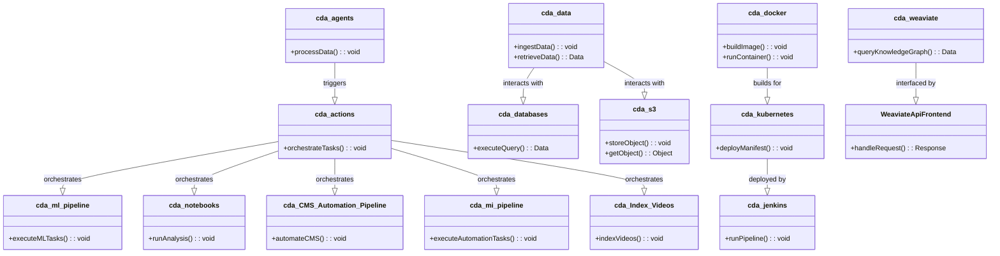
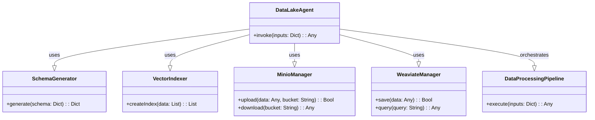

# cda.data-lake
## Public Facing Repository

Cdaprod Data Lake for cda namespace.

# Data Lake Project

Welcome to the Data Lake Project repository. This document provides an overview of the architecture, technologies used, and guidelines for contributors.

## Overview

Our Data Lake is designed to be a centralized repository that allows you to store all your structured and unstructured data at any scale. It's built to handle high volumes of data, from various sources, in different formats. The goal is to make data accessible for various analytics and machine learning endeavors.

## Architecture

The architecture of our Data Lake is designed for scalability, reliability, and security. Here's a high-level overview:

- **Ingestion Layer**: Handles the intake of data from various sources.
- **Storage Layer**: Comprises a scalable and secure data storage system.
- **Processing Layer**: For data transformation and processing tasks.
- **Consumption Layer**: Where data is served to end-users or applications.

## Technologies & Tools

We leverage a variety of technologies and tools to build and maintain our Data Lake:


## Getting Started

To get started with the Data Lake project, please refer to the following guides:

- **Installation**: Instructions on setting up the Data Lake environment.
- **Configuration**: How to configure data ingestion and processing workflows.
- **Usage**: Documentation on using the Data Lake for analytics.

## Contribution Guidelines

We welcome contributions from the community. Please refer to `CONTRIBUTING.md` for more details on how to submit pull requests, report issues, and suggest enhancements.

## License

This project is licensed under the terms of the MIT license.

## Contact

For any further queries, please reach out to the project maintainers:

- **David Cannan**: [Github](https://github.com/Cdaprod/Cdaprod)

Thank you for your interest in our Data Lake project!

---

This README is part of the Data Lake documentation:

```/Development/Documentation/DataLakeREADME.md```


---

# Layers

Creating a class diagram for your repository structure can help visualize the relationships and hierarchies within your system. I will outline a Mermaid.js class diagram for you, which you can use in a compatible editor to generate the visual representation.

Here's a Mermaid.js class diagram for the repositories as classes and their relationships:


Organization of your codebase and dependencies between the different layers. 👆

---

# Example Repo Directory Structures

Certainly, setting up a consistent and clear directory structure within each of your repositories is crucial for maintainability and understandability. Below are examples of how you might structure the directories within some of your repositories based on their intended purposes:

1. **cda.data** (Data Management):
   ```
   cda.data/
   ├── datasets/
   │   ├── raw/
   │   └── processed/
   ├── scripts/
   │   ├── etl/
   │   └── cleaning/
   ├── schemas/
   ├── tests/
   └── README.md
   ```

2. **cda.langchain** (Application Logic):
   ```
   cda.langchain/
   ├── agents/
   │   ├── chat/
   │   └── retrieval/
   ├── tools/
   ├── chains/
   ├── pipelines/
   ├── schemas/
   ├── api/
   │   ├── v1/
   │   └── utils/
   ├── tests/
   └── README.md
   ```

3. **cda.retrieval-plugin** (Plugin for ChatGPT and Vectorstores):
   ```
   cda.retrieval-plugin/
   ├── src/
   │   ├── chatgpt/
   │   └── vectorstores/
   ├── config/
   ├── tests/
   └── README.md
   ```

4. **cda.kubernetes** (Infrastructure Deployment):
   ```
   cda.kubernetes/
   ├── manifests/
   │   ├── dev/
   │   └── prod/
   ├── charts/
   │   └── myapp/
   ├── scripts/
   └── README.md
   ```

5. **cda.weaviate** (Interface and Interaction):
   ```
   cda.weaviate/
   ├── config/
   ├── schema/
   ├── connectors/
   └── README.md
   ```

Each repository contains a `README.md` file that should provide an overview of the repository, setup instructions, and any other relevant information. 

The `tests/` directory should contain tests for your codebase, ensuring reliability and stability. 

The `scripts/` directory can hold various scripts for deployment, database migrations, or other automation tasks.

For the repositories dealing with data (`cda.data`, for instance), there are separate directories for raw and processed datasets, ensuring a clear distinction in the data processing pipeline.

The `schemas/` directory is where you define the structure of your data models or API request/response formats.

These structures can, of course, be adjusted to fit the specific needs of each repository or to reflect your preferred organizational strategy. Each repository will vary based on its function within your overall architecture.

---

Creating a data lake infrastructure on a Kubernetes platform is a large-scale project that requires careful planning, robust design, and efficient execution. The `Cdaprod` GitHub organization hosts a variety of repositories, each serving a unique role in this overarching project. Let's delve into the engineering perspective of how these repositories intertwine to form a coherent and functional data lake infrastructure.




### Python Agents:
- The `cda.agents` repository hosts Python agents that are instrumental in processing and handling data within the infrastructure. These agents can be envisaged as standalone microservices or components within a larger service, each tailored to perform specific tasks such as data validation, transformation, or any other data-centric operation.

### Workflows:
- The `cda.actions` repository encapsulates the workflows within the system. These workflows orchestrate the execution of tasks, ensuring that each task is carried out in the correct order and adheres to the specified conditions. They serve as the glue that binds the various microservices and components together into a coherent process flow.

### Data Pipelines:
- The repositories `cda.ml-pipeline` and `cda.notebooks` are dedicated to housing Python functions as modular scripts and Jupyter notebooks respectively. These repositories are central to the data processing and machine learning operations within the data lake. They host the logic and functions necessary for analyzing, processing, and extracting insights from the data.

### Automation Pipelines:
- The `cda.CMS_Automation_Pipeline` and `cda.mi-pipeline` repositories manage automation for Content Management System (CMS) operations and other miscellaneous automation pipelines respectively. They ensure that repetitive and routine tasks are automated, enhancing efficiency, and reducing the scope for human error.

### Data Management:
- Repositories like `cda.data`, `cda.databases`, and `cda.s3` are pivotal for data management. They handle data ingestion, storage, and database operations, ensuring that data is correctly stored, indexed, and available for processing when needed.

### Infrastructure and Deployment:
- The `cda.docker`, `cda.kubernetes`, and `cda.jenkins` repositories are integral for infrastructure provisioning and application deployment. They contain the configurations, manifests, and pipelines necessary for deploying, scaling, and managing the applications and services within the Kubernetes cluster.

### Interface and Interaction:
- `cda.weaviate` and `WeaviateApiFrontend` repositories are key to interfacing with the Weaviate knowledge graph and managing frontend interactions respectively. They ensure that the data within the data lake is accessible and manageable through a user interface.

### Content and Media:
- The `cda.Index-Videos` repository is dedicated to managing video indexing operations, ensuring that video content is properly indexed and searchable within the data lake.

`/path/engineering_description_and_class_diagram.md`

In this Mermaid.js class diagram, we've represented each repository as a class, with methods indicating the primary operations they perform. The relationships between these classes hint at the interactions between different repositories in orchestrating the overall data lake operations. This visual representation should provide a clear understanding to a DevOps professional about the roles and interactions of each repository within the project.


### Repositories Overview:

1. **Python Agents:**
   - `cda.agents`: Houses Python agents responsible for various data processing tasks.
   
2. **Workflows:**
   - `cda.actions`: Contains workflow definitions and orchestration logic.

3. **Data Pipelines:**
   - `cda.ml-pipeline`: Hosts Python functions for machine learning pipelines as modular scripts.
   - `cda.notebooks`: Contains Jupyter notebooks for data analysis and processing.
   
4. **Automation Pipelines:**
   - `cda.CMS_Automation_Pipeline`: Manages automation for Content Management System (CMS) operations.
   - `cda.mi-pipeline`: Handles miscellaneous automation pipelines.
   
5. **Data Management:**
   - `cda.data`: Manages data ingestion and storage.
   - `cda.databases`: Handles database configurations and operations.
   - `cda.s3`: Manages S3-compatible object storage operations.

6. **Infrastructure and Deployment:**
   - `cda.docker`: Contains Docker configurations and files.
   - `cda.kubernetes`: Houses Kubernetes configurations and deployment manifests.
   - `cda.jenkins`: Hosts Jenkins configurations for CI/CD pipelines.

7. **Interface and Interaction:**
   - `cda.weaviate`: Contains files for deploying and configuring Weaviate.
   - `WeaviateApiFrontend`: Manages frontend interactions with Weaviate API.

8. **Content and Media:**
   - `cda.Index-Videos`: Manages video indexing operations.

9. **Miscellaneous:**
   - `cda.dotfiles`: Hosts configuration files.
   - `cda.faas`: Function as a Service (FaaS) configurations.
   - `cda.pull`: Miscellaneous operations.
   - `cda.resumes`: Repository for hosting resumes.
   - `cda.snippets`: Code snippets and utilities.
   - `cda.superagent`: Superagent configurations and files.
   - `cda.ZoomVirtualOverlay`: Manages Zoom Virtual Overlay operations.
   - `dotfiles`: Configuration files.
   - `knowledge-platform`: Houses the knowledge platform files.

10. **External Interaction:**
    - `ApacheAirflow`: Hosts configurations for Apache Airflow orchestration.

# LATEST INFO: 
To build a machine learning pipeline that integrates the repositories you've listed, we can take the following steps:

1. **Setup the Environment**:
   - Create a virtual environment to manage dependencies.
   - Install required Python packages for Jupyter, ML libraries, etc.

2. **Repository Integration**:
   - Clone necessary repositories using your GitHub credentials.
   - Organize the repository content into a structured directory within the notebook environment.

3. **Namespace Standardization**:
   - Establish a standard naming convention for all resources.
   - Reflect this namespace in the directory structure and code modules.

4. **Documentation**:
   - Document each step in markdown cells within the Jupyter notebook.
   - Include detailed explanations and justifications for decisions made.

5. **Infrastructure as Code (IaC)**:
   - Use %%writefile to create necessary configuration files for Docker, Kubernetes, etc.
   - Ensure all infrastructure code is version-controlled and parameterized.

6. **Workflow and Automation**:
   - Define workflows using Python functions and classes.
   - Implement GitHub actions for CI/CD in the `cda.actions` repository.

7. **Data Pipelines**:
   - Set up data ingestion from the `cda.data-lake`.
   - Implement ML pipeline stages in `cda.ml-pipeline`.
   - Analyze and process data in `cda.notebooks`.

8. **ML Pipeline Development**:
   - Develop modular scripts/functions for machine learning tasks.
   - Ensure reproducibility and ease of use.

9. **Interface and Interaction**:
   - Configure interfaces for data interaction, such as Weaviate.
   - Build out the frontend for Weaviate API interactions.

10. **Content and Media Management**:
    - Integrate video indexing operations from `cda.Index-Videos`.

11. **External Interaction**:
    - Set up Nginx configurations for external communication.

12. **Version Control and Project Management**:
    - Create a GitHub project to manage tasks and track progress.
    - Regularly commit changes to document the evolution of the infrastructure.

13. **Testing and Validation**:
    - Write tests for each component.
    - Validate the pipeline with sample data.

14. **Execution and Scheduling**:
    - Automate the execution of the Jupyter notebooks using `cda.Juno`.
    - Schedule regular runs with Jenkins or a similar tool.

15. **Documentation and Sharing**:
    - Finalize the documentation with a comprehensive overview and usage instructions.
    - Share the notebook environment as an exportable package or a container image.

This is a high-level plan. To proceed, we can start by setting up the environment and cloning the repositories. Since this is exploratory development, we'll refine the steps as we progress, documenting and scripting the setup in Python within a Jupyter notebook environment.

Ready to proceed with these tasks? Let's begin with the environment setup. Would you like to start with that or is there a specific area you want to tackle first?
 
# INFO: Building a data lake

Designing a schema for your repository, particularly as it evolves into a data lake, requires a thoughtful approach to ensure scalability, efficiency, and ease of use. Here are some insights gathered from multiple sources on best practices and considerations for designing a schema for your data lake project:

1. **Layering Data**:
   - A well-designed data lake often has various layers including Raw, Standardized, Cleansed, Application, and Sandbox layers. Each layer serves a distinct purpose and ensures that data flows logically through the lake:
     - **Raw Data Layer** (Ingestion Layer): This layer ingests data as quickly and efficiently as possible, keeping data in its native format with no transformations allowed at this stage. It's organized into folders, typically based on subject area, data source, object, and the date of ingestion [oai_citation:1,Data Lake Architecture: How to Create a Well Designed Data Lake](https://lingarogroup.com/blog/data-lake-architecture).
     - **Standardized Data Layer**: This optional layer improves data transfer performance from Raw to Curated, choosing a format best suited for cleansing.
     - **Cleansed Data Layer** (Curated Layer): Here, data is transformed into consumable datasets, stored in files or tables, with known purposes and structures. This layer often undergoes cleansing, denormalization, and consolidation of different objects.
     - **Application Data Layer** (Trusted Layer): This layer is sourced from the Cleansed layer and enforced with any necessary business logic. It may also house machine learning models calculated on the data lake.
     - **Sandbox Data Layer**: Another optional layer for advanced analysts and data scientists to conduct experiments, look for patterns, or correlations [oai_citation:2,Data Lake Architecture: How to Create a Well Designed Data Lake](https://lingarogroup.com/blog/data-lake-architecture).

2. **Structuring Data Sets**:
   - Use folder hierarchies to organize data in the data lake, enabling efficient data management and retrieval. It's advisable to structure folders based on functional areas, topics, or data sources, followed by a time-based hierarchy (year/month/day) [oai_citation:3,Error](data:text/plain;charset=utf-8,Unable%20to%20find%20metadata).

3. **Data Lake Design Principles**:
   - **Security and Access Controls**: It's crucial to implement robust security mechanisms and access controls to protect data and ensure only authorized individuals can access specific datasets.
   - **Metadata Management**: Manage metadata effectively to provide context, enable search, and ensure users understand the data they are working with.
   - **Data Quality and Governance**: Establish processes to ensure data quality, monitor data usage, and maintain governance policies across the data lake [oai_citation:4,Error](data:text/plain;charset=utf-8,Unable%20to%20find%20metadata).

4. **Partitioning and Indexing**:
   - Partitioning data based on certain key attributes and creating indexes can significantly improve query performance and data accessibility [oai_citation:5,Error](data:text/plain;charset=utf-8,Unable%20to%20find%20metadata).

5. **Consistent Data Formats and Compression**:
   - Utilize consistent data formats and compression techniques to optimize storage and improve data processing efficiency [oai_citation:6,Error](data:text/plain;charset=utf-8,Unable%20to%20find%20metadata).

6. **Utilizing a Schema Registry**:
   - Implementing a schema registry can be beneficial to manage and evolve schemas efficiently, particularly in a growing data lake scenario.

Your project, which involves analyzing, tokenizing, ETL processes, and creating custom objects from bucket data, can benefit from these principles and best practices. It's advisable to consider how data will flow through your repository, the transformations it will undergo, and how it will be consumed by end users or applications. Establishing a well-considered schema and organizing data efficiently from the outset will contribute to the successful evolution of your repository into a structured and manageable data lake.

# INFO: AI+S3=Implications Galore

AWS S3 and MinIO can be powerful tools when building a data lake, especially in conjunction with AI applications. Here's how they contribute to managing and utilizing data for AI, and how you could potentially utilize them for storing and executing code:

1. **Data Storage and Management**:
    - AWS S3 provides a robust and scalable storage solution that's commonly used as the underlying storage layer for data lakes. It supports storing vast amounts of data which can be accessed and analyzed by AI applications【11†source】.
    - MinIO, being S3 compatible, can serve as an alternative to AWS S3. It is designed for high-performance access to data and is often used in machine learning, analytics, and other data-heavy workloads【13†source】【14†source】.

2. **AI Datalake Software Stack**:
    - There are AI datalake software stacks built on top of high-performance, S3 compatible object storage like MinIO. Such configurations allow for the efficient management and utilization of data within AI applications【12†source】.

3. **Running AI Algorithms**:
    - The performance characteristics of MinIO enable the running of AI algorithms without the storage becoming a bottleneck. This is crucial for AI applications that require real-time processing or analysis of data【14†source】.

4. **SDKs for Interaction**:
    - MinIO provides SDKs (like the Python SDK) for interaction with the storage, which can be useful for programmatically managing data and potentially executing code stored in buckets【15†source】.

For managing tools for the data lake agent, you might want to consider creating a centralized tool management system or framework. This could be a software layer that keeps track of available tools, manages access to these tools, and coordinates their usage.

Additionally, for utilizing Weaviate (your database) extensively, you could design your data lake such that it interacts with Weaviate for various data operations like querying, indexing, or updating data. 

To create vector indexes from your schemas and data, you could potentially use a library or tool that supports vector indexing (like Annoy or FAISS) and design a process that reads your data from S3/MinIO, processes it to generate vector indexes, and then stores these indexes in a manner that's accessible to your applications.

For storing code in MinIO buckets akin to AWS's feature, you might need to set up an environment where code can be executed from the storage directly or copied from storage to an execution environment. This could potentially be achieved through a combination of SDKs, APIs, and orchestration tools.

The integration of AWS S3 or MinIO with AI applications seems to revolve around efficient data storage, access, and management which are critical for the performance and scalability of AI applications.

# INFO: Building a schema generator and manager for a data lake environment

Creating a schema generator and manager for a custom-built data lake, especially one that analyzes unstructured data and generates custom objects using Langchain, entails a multi-faceted approach. Below are steps and considerations to guide the development of such a system, given your context:

1. **Understanding Data Characteristics**:
   - **Data Exploration**: Before schema generation, it’s crucial to have a deep understanding of the data your lake will handle. Explore the unstructured data to identify common patterns, types, and structures.
   - **Metadata Extraction**: Extract metadata from the data to understand its characteristics. This could include data types, relationships, and other relevant information.

2. **Custom Object Definition**:
   - **Object Templates**: Create templates for custom objects that can be generated based on the analyzed data. 
   - **Data Mapping**: Develop a mechanism for mapping the analyzed data to these custom object templates.

3. **Schema Generation**:
   - **Automated Schema Detection**: Build functions that can analyze the data and automatically suggest or generate schemas.
   - **Schema Validation**: Create validation routines to ensure that generated schemas are accurate and complete.
   - **Schema Evolution**: Implement mechanisms to handle schema evolutions as data changes over time.

4. **Schema Management**:
   - **Schema Registry**: Establish a schema registry to store, manage, and retrieve schemas.
   - **Version Control**: Implement version control for schemas to track changes over time and ensure consistency.

5. **Integration with Langchain**:
   - **Custom Agents and Tools**: Develop custom Langchain agents and tools that can interact with your schema generator and manager, facilitating the processes of data ingestion, tokenization, parsing, and object generation.
   - **Pipeline Creation**: Create pipelines within Langchain that automate the flow from data ingestion to custom object generation and storage.

6. **Performance Optimization**:
   - **Optimized Data Processing**: Optimize the performance of your schema generator and manager to handle large volumes of unstructured data efficiently.
   - **Parallel Processing**: Implement parallel processing where possible to speed up data analysis and schema generation.

7. **User Interface and Interaction**:
   - **UI for Schema Management**: Develop a user interface for managing schemas, viewing schema generation results, and tweaking or validating schemas.
   - **Feedback Loop**: Implement a feedback loop allowing users or system administrators to refine schemas and improve the schema generation process.

8. **Testing and Evaluation**:
   - **Unit Testing**: Create unit tests to verify the correctness of your schema generation and management code.
   - **Performance Testing**: Conduct performance testing to ensure your system can handle the expected data volumes and processing load.

9. **Documentation and Training**:
   - **Documentation**: Document your schema generator and manager’s architecture, functionalities, and usage guidelines.
   - **Training**: Provide training to end-users and administrators on how to use the system effectively.

10. **Monitoring and Maintenance**:
- Monitoring: Implement monitoring to track system performance, errors, and other important metrics.
- Maintenance: Establish a maintenance plan to address issues, optimize performance, and adapt to evolving requirements.

By meticulously designing and implementing each of these aspects, you’ll be well on your way to developing a robust schema generator and manager for your custom-built data lake. This will also facilitate the streamlined interaction between your data lake and Langchain components, ensuring efficient data processing and custom object generation.

# Engineering Steps for schema generator

Designing a schema generator and manager to handle your specified requirements can be a complex task, but with a well-thought-out plan, it's entirely achievable. Here's a detailed step-by-step strategy:

1. **Identify and Classify Data Sources**:
   - Recognize different data sources: markdown documents, code blocks, Python scripts, and notebook cells.
   - Determine how you'll identify and extract relevant data from these sources.

2. **Data Extraction and Parsing**:
   - Develop parsing algorithms to extract text, code, metadata, and other relevant information from the identified sources.
     - For markdown documents, consider using libraries like `markdown2` or `Markdown` to convert markdown to HTML, and then use HTML parsing libraries like `BeautifulSoup` to extract the necessary information.
     - For Python scripts and notebook cells, consider using `ast` (Abstract Syntax Trees) or `nbformat` to extract code and comments.

3. **Natural Language Processing (NLP)**:
   - Employ NLP techniques to process text data, which could help in understanding the context, extracting metadata, and identifying relationships between different pieces of information.

4. **Vectorization**:
   - For your vectorstore indices (`PythonCode` and `PythonDocs`), implement vectorization techniques to convert text and code into vector representations.
     - Libraries like `spaCy`, `gensim`, or `scikit-learn` can be helpful for vectorization.

5. **Relation/Edge Identification**:
   - Implement algorithms to identify relations or edges between different pieces of code and documentation.
   - Utilize techniques like similarity measurement, reference detection, or even machine learning models to identify and classify relations.

6. **Schema Generation**:
   - Based on the parsed data and identified relations, generate a schema for your data lake.
   - Ensure that the schema is flexible enough to accommodate the evolving nature of your projects and data.

7. **Schema Management**:
   - Implement a schema management system that allows you to update, modify, and version your schema as your data lake grows and changes.
   - Ensure there's a user-friendly interface for managing the schema, possibly integrating with your existing Jupyter notebook setup.

8. **Automation**:
   - Automate the entire process from data extraction to schema generation and management.
   - Ensure that the system can handle new data, updates, and changes in an automated or semi-automated fashion.

9. **Testing and Validation**:
   - Design thorough testing and validation processes to ensure the accuracy and reliability of the generated schema and the overall system.

10. **User Input and Customization**:
    - Provide a mechanism for you to input custom instructions, prompts, or templates to guide the schema generation process.
    - Ensure that the system can handle custom user input and generate schemas accordingly.

11. **Monitoring and Logging**:
    - Implement monitoring and logging to track the system's performance, catch errors, and provide insights into the schema generation and management process.

12. **Documentation**:
    - Document the entire system thoroughly, explaining the architecture, processes, and how to use and customize the schema generator and manager.

13. **Training and Tuning**:
    - If machine learning models are employed, ensure there's a mechanism for training, tuning, and updating the models to improve performance over time.

14. **User Interface**:
    - If necessary, develop a user-friendly interface for interacting with the schema generator and manager, providing visibility into the process and allowing for customizations and adjustments.

15. **Feedback Loop**:
    - Establish a feedback loop for continuous improvement, where you can provide feedback, corrections, and improvements to the system based on the results and performance.

This systematic approach should provide a solid foundation for developing a comprehensive schema generator and manager to handle your data lake's unique requirements.

# Langchain Expression Language for the data lake tools/apps/interface

Creating a comprehensive solution using LangChain, incorporating agents with memory, and setting up a pipeline requires a well-structured approach. Below is an attempt to sketch out how you might structure the components for your data lake and schema generator using LangChain's concepts. This is quite a high-level outline and may require further refinement to meet your project's exact specifications:

1. **Import Necessary Libraries**:

```python
from langchain.runnables import Runnable, Chain
from langchain.memory import Memory
from minio import Minio
import pandas as pd
from io import BytesIO
```

2. **Setup Minio Client**:

```python
minio_client = Minio(
    endpoint='minio.example.com',
    access_key='your-access-key',
    secret_key='your-secret-key',
    secure=False
)
```

3. **Define Runnables for Data Lake Operations**:

```python
class BucketManager(Runnable):
    def run(self, bucket_name):
        if not minio_client.bucket_exists(bucket_name):
            minio_client.make_bucket(bucket_name)
        return bucket_name

class DataIngestion(Runnable):
    def run(self, bucket_name, data, object_name):
        minio_client.put_object(
            bucket_name, object_name, data,
            length=len(data),
        )
        return object_name

class DataRetrieval(Runnable):
    def run(self, bucket_name, object_name):
        data = minio_client.get_object(bucket_name, object_name)
        return data.read()
```

4. **Define Runnables for Schema Generation**:

```python
class DataLoader(Runnable):
    def run(self, bucket_name, object_name):
        data = DataRetrieval().run(bucket_name, object_name)
        data_buffer = BytesIO(data)
        df = pd.read_csv(data_buffer)  # Assuming CSV format, adjust as needed
        return df

class SchemaInference(Runnable):
    def run(self, df):
        schema = df.dtypes.to_dict()
        return schema

class SchemaDefinitionGenerator(Runnable):
    def run(self, schema, file_path):
        with open(file_path, 'w') as f:
            for column, dtype in schema.items():
                f.write(f'{column}: {dtype}\n')
        return file_path
```

5. **Create Chains for Each Process**:

```python
data_ingestion_chain = Chain([BucketManager(), DataIngestion()])
data_retrieval_chain = Chain([DataRetrieval()])
schema_generation_chain = Chain([DataLoader(), SchemaInference(), SchemaDefinitionGenerator()])
```

6. **Define Agent with Memory**:

```python
class DataLakeAgent(Runnable):
    memory = Memory()

    def run(self, action, **kwargs):
        self.memory.load_memory_variables(kwargs)
        if action == 'ingest':
            return data_ingestion_chain.run(**kwargs)
        elif action == 'retrieve':
            return data_retrieval_chain.run(**kwargs)
        elif action == 'generate_schema':
            return schema_generation_chain.run(**kwargs)
        else:
            raise ValueError(f"Unknown action: {action}")
```

7. **Use the Agent to Coordinate Operations**:

```python
agent = DataLakeAgent()

# Ingest data
agent.run('ingest', bucket_name='example_bucket', data=b'sample data', object_name='data.txt')

# Generate schema
agent.run('generate_schema', bucket_name='example_bucket', object_name='data.txt', file_path='schema.txt')
```

This outline demonstrates how you might structure your data lake and schema generator operations within a LangChain framework, utilizing runnables, chains, and an agent with memory to coordinate the operations. Remember, this is a simplified outline and may require further customization and error handling to suit your project's needs.

# LCEL Agent Toolkit

Creating an agent toolkit using LangChain would allow you to abstract the various functionalities into reusable components. Let's start by building a toolkit with the outlined runnables and chains, then we'll move on to creating vector indexes from your schemas and data.

### Step 1: Agent Toolkit

You'll want to define each of your tools and your agent within the LangChain framework. Here's a simplified example based on the components you've already developed:

```python
from langchain.agents import Agent, tool
from langchain.schema import Runnable
from langchain.memory import Memory

# ... (previous runnable definitions)

class DataLakeToolkit(Agent):
    memory = Memory()

    @tool
    def manage_bucket(self, bucket_name: str):
        return BucketManager().run(bucket_name)

    @tool
    def ingest_data(self, bucket_name: str, data: bytes, object_name: str):
        return DataIngestion().run(bucket_name, data, object_name)

    @tool
    def retrieve_data(self, bucket_name: str, object_name: str):
        return DataRetrieval().run(bucket_name, object_name)

    @tool
    def generate_schema(self, bucket_name: str, object_name: str, file_path: str):
        df = DataLoader().run(bucket_name, object_name)
        schema = SchemaInference().run(df)
        return SchemaDefinitionGenerator().run(schema, file_path)
```

### Step 2: Vector Indexing

For creating vector indexes from your schemas and data, you might use a library such as Annoy or Faiss. These libraries can create vector indexes that allow for efficient similarity searches.

Here's a simplified runnable for generating a vector index using Annoy:

```python
from annoy import AnnoyIndex
import pandas as pd
from io import BytesIO

class VectorIndexer(Runnable):
    def run(self, df: pd.DataFrame, target_column: str, index_file_path: str):
        # Assume the target column contains vector data
        vectors = df[target_column].tolist()
        vector_length = len(vectors[0])
        
        index = AnnoyIndex(vector_length, 'angular')
        for i, vector in enumerate(vectors):
            index.add_item(i, vector)
        
        index.build(10)  # 10 trees - adjust as needed
        index.save(index_file_path)
        
        return index_file_path

# Chain it with DataLoader to process data from Minio
vector_indexing_chain = Chain([DataLoader(), VectorIndexer()])
```

In the `VectorIndexer` runnable, we've assumed that your dataframe has a column containing vector data. We create an Annoy index, add each vector to the index, build the index, and save it to a file. You can chain this runnable with `DataLoader` to process data directly from your Minio buckets.

You might want to adjust or extend this code to suit your particular needs, especially the vector extraction and index construction parts.

Incorporating these components into your LangChain-based toolkit would enable a fairly modular and extensible architecture for managing your data lake and conducting vector-based analytics.

# LCEL Tool Management

Managing tools for the Data Lake agent in a structured and modular way requires a well-defined framework. You can create a set of tools each dedicated to a specific task within your data lake operations, and coordinate them using LangChain's agent and tool mechanisms. Here's an outline on how to proceed:

### 1. **Define Tool Classes**:

Define classes for each of the major tasks you need to handle within your data lake. These tasks might include:

- **Data Ingestion**
- **Data Retrieval**
- **Schema Generation**
- **Vector Indexing**
- **Query Execution**

Each tool can be a wrapper around the functionality provided by your existing systems, Minio for data storage, and Weaviate for vector indexing and search.

```python
from langchain import tool
from minio import Minio
from weaviate import Client

minio_client = Minio('your-minio-endpoint')
weaviate_client = Client('your-weaviate-endpoint')

@tool
def ingest_data(bucket_name: str, object_name: str, data: bytes):
    # Logic to ingest data into Minio
    pass

@tool
def retrieve_data(bucket_name: str, object_name: str):
    # Logic to retrieve data from Minio
    pass

@tool
def index_vectors(bucket_name: str, object_name: str):
    # Logic to index vectors with Weaviate
    pass

@tool
def query_vectors(vector: list, n: int):
    # Logic to query vectors from Weaviate
    pass

#... More tools as needed
```

### 2. **Define the Data Lake Agent**:

Define an agent that manages these tools, providing a high-level interface to your data lake operations.

```python
from langchain.agents import Agent

class DataLakeAgent(Agent):
    @tool
    def ingest_and_index(self, bucket_name: str, object_name: str, data: bytes):
        ingest_data(bucket_name, object_name, data)
        index_vectors(bucket_name, object_name)

    @tool
    def retrieve_and_query(self, bucket_name: str, object_name: str, vector: list, n: int):
        data = retrieve_data(bucket_name, object_name)
        similar_vectors = query_vectors(vector, n)
        return data, similar_vectors

#... More high-level operations as needed
```

### 3. **Coordination and Pipelines**:

Utilize LangChain's chaining and runnable mechanisms to create pipelines for processing tasks. Define sequences of operations that handle data from ingestion to retrieval, indexing, and querying.

```python
from langchain import Chain

ingest_index_chain = Chain([ingest_data, index_vectors])
retrieve_query_chain = Chain([retrieve_data, query_vectors])

#... More chains as needed
```

### 4. **Memory Management**:

Implement memory management within your agent to keep track of ongoing operations, handle dependencies between tasks, and manage the state of your data lake.

```python
from langchain.memory import Memory

class DataLakeMemory(Memory):
    # Implement your memory management logic
    pass

data_lake_agent = DataLakeAgent(memory=DataLakeMemory())
```

By structuring your tools, agent, and pipelines in this way, you can create a well-organized toolkit for managing your data lake operations. This structure also allows for easy extension as your needs evolve over time, such as integrating more closely with Weaviate for vector indexing and search.

# MinIO Bucket => CodeDocs (source code)

In order to store code in a Minio bucket and then utilize a Schema Generator to create a Tool class schema along with JSON objects for all the code within the bucket, a few steps are needed. Here's a structured approach on how to accomplish this:

### 1. **Upload Code to Minio**:

Firstly, upload the code files to a Minio bucket. You can create a specific bucket for this purpose, let's call it `codedocs`. You can use the `ingest_data` tool to handle the upload:

```python
# Assuming each code file is a string
code_files = {
    'data_lake_tools.py': code_data_lake_tools,
    'data_lake_agent.py': code_data_lake_agent,
    # ... other code files
}

bucket_name = 'codedocs'

for object_name, code in code_files.items():
    ingest_data(bucket_name, object_name, code.encode())
```

### 2. **Create Schema Generator Tool**:

Create a tool that can generate a schema for a `CodeDocs` class, as well as JSON objects for each code file in the bucket:

```python
@tool
def schema_generator(bucket_name: str):
    # Retrieve all code objects from the bucket
    code_objects = list(minio_client.list_objects(bucket_name))

    # Create a class schema for CodeDocs
    class_schema = {
        'class': 'CodeDocs',
        'properties': []
    }

    json_objects = []

    for obj in code_objects:
        object_name = obj.object_name
        code = retrieve_data(bucket_name, object_name).decode()

        # Generate a JSON object for each code file
        json_object = {
            'type': 'CodeDocs',
            'id': object_name,
            'code': code
        }

        json_objects.append(json_object)

        # Update the class schema with a property for this code file
        class_schema['properties'].append({
            'name': object_name,
            'dataType': ['text']
        })

    # You could also upload the schema and JSON objects back to Minio
    # Or use them as needed in your application

    return class_schema, json_objects
```

### 3. **Invoke Schema Generator**:

Now, invoke the `schema_generator` tool to generate the `CodeDocs` class schema and the JSON objects for each code file:

```python
class_schema, json_objects = schema_generator(bucket_name)
```

This will return a schema for the `CodeDocs` class, along with a list of JSON objects representing each code file in the `codedocs` bucket.

### 4. **Utilize Schema and JSON Objects**:

With the generated schema and JSON objects, you can now create a Weaviate schema and import the data into Weaviate, or use them as needed within your application. For instance, you could create a `CodeDocs` class in Weaviate with the generated schema, and then import the JSON objects as data instances of the `CodeDocs` class.

This way, you organize and store your code in a structured and searchable manner, making it easier to manage and retrieve as needed.

# Setting up MinIO ( store source code )

AWS provides a service known as AWS CodeArtifact, which is a fully managed artifact repository compatible with language-native package managers and build tools such as npm, Apache Maven, and pip. However, if you're looking at storing source code in S3 buckets, it's more of a manual process or done through CI/CD pipelines using services like AWS CodeBuild or AWS CodePipeline. Here's a simplified process on how AWS stores source code in S3 buckets and how you might replicate this with MinIO:

### AWS Process:

1. **Bucket Creation**:
   - Create an S3 bucket where the source code will be stored.

2. **Uploading Source Code**:
   - Use the AWS SDK or AWS CLI to upload source code files to the S3 bucket.

3. **Access Control**:
   - Set up IAM roles and policies to control access to the source code in the S3 bucket.

4. **Versioning (Optional)**:
   - Enable versioning on the S3 bucket to keep multiple variants of an object in the same bucket.

5. **Notification and Events (Optional)**:
   - Configure S3 Events to trigger notifications or run Lambda functions when new code is uploaded.

### MinIO Replication:

1. **Bucket Creation**:
   - Similarly, create a MinIO bucket where the source code will be stored.

```python
from minio import Minio

minio_client = Minio(
    endpoint='your-minio-endpoint',
    access_key='your-access-key',
    secret_key='your-secret-key',
    secure=False  # Set to True if your Minio server uses TLS
)

bucket_name = 'source-code'
minio_client.make_bucket(bucket_name)
```

2. **Uploading Source Code**:
   - Use the MinIO Python SDK to upload source code files to the MinIO bucket.

```python
def upload_code(file_path, object_name):
    with open(file_path, 'rb') as file_data:
        file_stat = os.stat(file_path)
        minio_client.put_object(bucket_name, object_name, file_data, file_stat.st_size)

upload_code('/path/to/your/code.py', 'code.py')
```

3. **Access Control**:
   - MinIO also supports configuring access permissions using a similar policy-based approach.

```python
policy = {
    "Version": "2012-10-17",
    "Statement": [
        {
            "Effect": "Allow",
            "Principal": {"AWS": ["*"]},
            "Action": ["s3:GetObject"],
            "Resource": [f"arn:aws:s3:::{bucket_name}/*"]
        }
    ]
}

minio_client.set_bucket_policy(bucket_name, json.dumps(policy))
```

4. **Versioning (Optional)**:
   - Enable versioning on the MinIO bucket to keep multiple variants of an object in the same bucket.

```python
minio_client.enable_versioning(bucket_name)
```

5. **Notification and Events (Optional)**:
   - MinIO also supports setting up notifications for events like object creation or deletion.

```python
notification_config = {
    "CloudFunctionConfigurations": [
        {
            "Events": ["s3:ObjectCreated:*"],
            "CloudFunction": "arn:minio:sqs::1:webhook",
            "Filter": {
                "Key": {
                    "FilterRules": [
                        {
                            "Name": "suffix",
                            "Value": ".py"
                        }
                    ]
                }
            }
        }
    ]
}

minio_client.set_bucket_notification(bucket_name, notification_config)
```

This way, you can recreate a similar setup for storing, versioning, and managing source code in MinIO as you would in AWS S3.

# MinIO Code Fetching and Execution

Creating a system to fetch and execute code from a Minio bucket requires a well-thought-out approach to ensure functionality, security, and maintainability. Here's a more detailed, low-level outline of how you could approach this task:

1. **Setting Up Minio**:
    - Install and configure Minio on a server or cloud instance.
    - Create a dedicated bucket for storing your code files.
    - Ensure that access to Minio is secured, e.g., by using access and secret keys, and by enabling HTTPS.

2. **Fetching Code from Minio**:
    - Use the Minio SDK (e.g., the Python SDK) to interact with your Minio instance.
    - Write a function to fetch code files from your Minio bucket:

```python
from minio import Minio
import os

# Initialize the Minio client
minio_client = Minio(
    endpoint='your-minio-endpoint',
    access_key='your-access-key',
    secret_key='your-secret-key',
    secure=True  # Enable HTTPS
)

def fetch_code(bucket_name, object_name, local_path):
    minio_client.fget_object(bucket_name, object_name, local_path)

# Usage
fetch_code('your-bucket', 'your-code-file.py', '/path/to/local/file.py')
```

3. **Setting Up an Execution Environment**:
    - Choose an execution environment. This could be a server, a virtual machine, or a containerized environment like Docker.
    - Ensure that the environment has all the necessary dependencies for executing your code.

4. **Executing Code**:
    - Write a function to execute the fetched code file:

```python
import subprocess

def execute_code(file_path):
    result = subprocess.run(['python', file_path], capture_output=True, text=True)
    print(result.stdout)
    print(result.stderr)

# Usage
execute_code('/path/to/local/file.py')
```

5. **Orchestration**:
    - Consider using an orchestration tool like Docker Compose or Kubernetes to manage the deployment and execution of your code.
    - Create a script or service that periodically checks for new or updated code files in your Minio bucket, fetches them, and executes them in your environment.

6. **Monitoring and Logging**:
    - Implement logging within your scripts and your execution environment to track the process, capture any errors, and record the output of your code executions.

7. **Error Handling**:
    - Implement robust error handling to manage scenarios where code fetching or execution fails. This could include retry logic, alerting, and logging.

8. **Security Considerations**:
    - Ensure that the execution environment is isolated and secure, and that code executed from the Minio bucket is trusted.
    - Consider implementing a code verification step before execution to ensure the integrity of the code.

9. **Testing and Validation**:
    - Thoroughly test your setup with various code files and scenarios to ensure it works as expected and is reliable.

This setup provides a low-level, manual approach to fetching and executing code from a Minio bucket, similar to how AWS Lambda can execute code stored in S3.

# Kubernetes MinIO-Python Sidecar ( Local Lambda Executor )

Creating a Minio deployment alongside a Python execution environment on Kubernetes can be a streamlined process using a single manifest file. A sidecar container pattern can be used to run your Python scripts. Here's an outline on how to structure your Kubernetes manifest to achieve this setup:

1. **Preparation**:
   - Ensure you have your Minio Docker image ready, or use the official Minio image from Docker Hub.
   - Prepare your Python environment Docker image with all the dependencies needed to run your scripts.

2. **Kubernetes Manifest**:
   - Create a `minio-python-env.yaml` file. This will be your Kubernetes manifest.

```yaml
apiVersion: apps/v1
kind: Deployment
metadata:
  name: minio-python-env
spec:
  replicas: 1
  selector:
    matchLabels:
      app: minio-python-env
  template:
    metadata:
      labels:
        app: minio-python-env
    spec:
      containers:
      - name: minio
        image: minio/minio:latest
        args:
        - server
        - /data
        env:
        - name: MINIO_ACCESS_KEY
          value: "your-access-key"
        - name: MINIO_SECRET_KEY
          value: "your-secret-key"
        ports:
        - containerPort: 9000

      - name: python-env
        image: your-python-image
        env:
        - name: MINIO_ENDPOINT
          value: "minio:9000"
        - name: MINIO_ACCESS_KEY
          value: "your-access-key"
        - name: MINIO_SECRET_KEY
          value: "your-secret-key"

---

apiVersion: v1
kind: Service
metadata:
  name: minio-service
spec:
  selector:
    app: minio-python-env
  ports:
    - protocol: TCP
      port: 9000
      targetPort: 9000
```

3. **Explanation**:
   - This manifest file defines a Kubernetes Deployment with two containers: one for Minio and one for your Python environment.
   - The Minio container is configured with necessary environment variables for access and secret keys.
   - The Python environment container (`python-env`) is configured with environment variables to connect to the Minio service.
   - A Kubernetes Service (`minio-service`) is defined to expose the Minio server on port 9000.

4. **Deployment**:
   - Deploy this manifest file using `kubectl apply -f minio-python-env.yaml`.
   - If using ArgoCD and Kustomize, you can place this manifest file in your repository and configure your ArgoCD application and Kustomize overlays accordingly.

5. **Script Execution**:
   - Your Python scripts can now be executed in the `python-env` container. Ensure your scripts are configured to interact with the Minio server using the provided environment variables.

6. **Kustomize and ArgoCD**:
   - If you need to manage variations of this manifest for different environments or configurations, you can create a Kustomize base and overlays for this manifest, and manage deployments through ArgoCD.

This setup allows for a sidecar Python environment alongside Minio, encapsulated within a single Kubernetes Deployment, facilitating a localized, offline script execution setup akin to AWS Lambda.

# Updated Repo Directory Structure

Based on the information gathered and your instructions, I will structure a Python codebase utilizing the LangChain Expression Language (LCEL) for your Data Lake project. This design will include a directory structure, file naming conventions, and a Mermaid.js class diagram to illustrate the interactions between different components of the Data Lake and its tools.

Directory Structure:
```plaintext
DataLakeRepo/
|-- data/
|   |-- raw_data/
|   |-- processed_data/
|-- src/
|   |-- tools/
|   |   |-- __init__.py
|   |   |-- schema_generator.py
|   |   |-- vector_indexer.py
|   |   |-- minio_manager.py
|   |   |-- weaviate_manager.py
|   |-- agents/
|   |   |-- __init__.py
|   |   |-- data_lake_agent.py
|   |-- pipelines/
|   |   |-- __init__.py
|   |   |-- data_processing_pipeline.py
|-- tests/
|   |-- __init__.py
|   |-- test_tools.py
|   |-- test_agents.py
|   |-- test_pipelines.py
|-- config/
|   |-- config.yaml
|-- main.py
|-- README.md
```

File Naming and Purpose:
- `main.py`: Entry point of the application.
- `data_lake_agent.py`: Defines the agent for managing data lake operations.
- `schema_generator.py`: Tool for generating schemas.
- `vector_indexer.py`: Tool for creating vector indexes.
- `minio_manager.py`: Tool for managing interactions with Minio.
- `weaviate_manager.py`: Tool for managing interactions with Weaviate.
- `data_processing_pipeline.py`: Defines the pipeline for data processing using LCEL.
- `test_*.py`: Files for unit testing corresponding modules.
- `config.yaml`: Configuration file for setting up the environment and dependencies.

Mermaid.js Class Diagram:


This structure provides a well-organized codebase where each component and tool has a designated place and purpose. The Mermaid.js class diagram illustrates the relationships and interactions between the Data Lake Agent and the various tools and pipelines within the system.

# Updated Directory Structure

Certainly! Integrating a Tool Manager within your structure would be crucial for handling the registration, discovery, and utilization of various tools within your Data Lake environment. The Tool Manager can be designed to provide a centralized point of control and interaction among agents, pipelines, and tools. Here's an updated directory structure and a Mermaid.js class diagram including a Tool Manager.

Directory Structure:
```plaintext
DataLakeRepo/
|-- data/
|   |-- raw_data/
|   |-- processed_data/
|-- src/
|   |-- tools/
|   |   |-- __init__.py
|   |   |-- schema_generator.py
|   |   |-- vector_indexer.py
|   |   |-- minio_manager.py
|   |   |-- weaviate_manager.py
|   |-- agents/
|   |   |-- __init__.py
|   |   |-- data_lake_agent.py
|   |-- pipelines/
|   |   |-- __init__.py
|   |   |-- data_processing_pipeline.py
|   |-- managers/
|   |   |-- __init__.py
|   |   |-- tool_manager.py
|-- tests/
|   |-- __init__.py
|   |   |-- test_tools.py
|   |   |-- test_agents.py
|   |   |-- test_pipelines.py
|   |   |-- test_managers.py
|-- config/
|   |-- config.yaml
|-- main.py
|-- README.md
```

File Naming and Purpose:
- `tool_manager.py`: Manages the registration, discovery, and utilization of tools within the Data Lake.

Mermaid.js Class Diagram:


In this updated structure, the `ToolManager` class is introduced within a new `managers` directory. The `ToolManager` class is responsible for managing the lifecycle and accessibility of the tools within the Data Lake. The `DataLakeAgent` interacts with the `ToolManager` to access and utilize the required tools, as depicted in the Mermaid.js class diagram.

